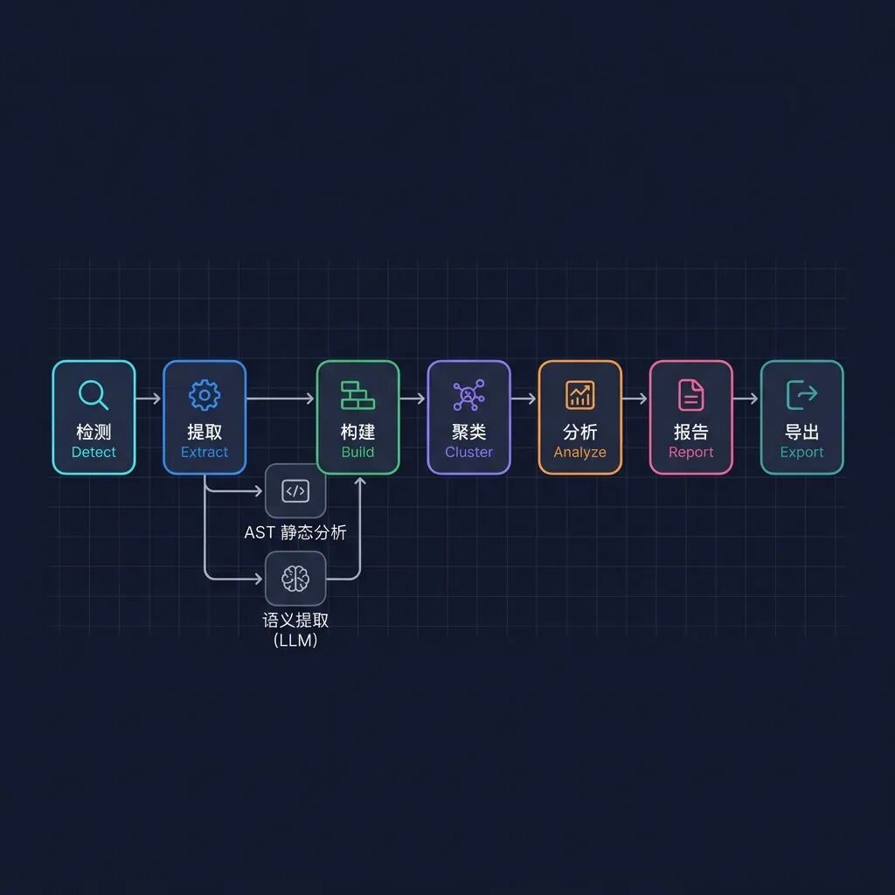
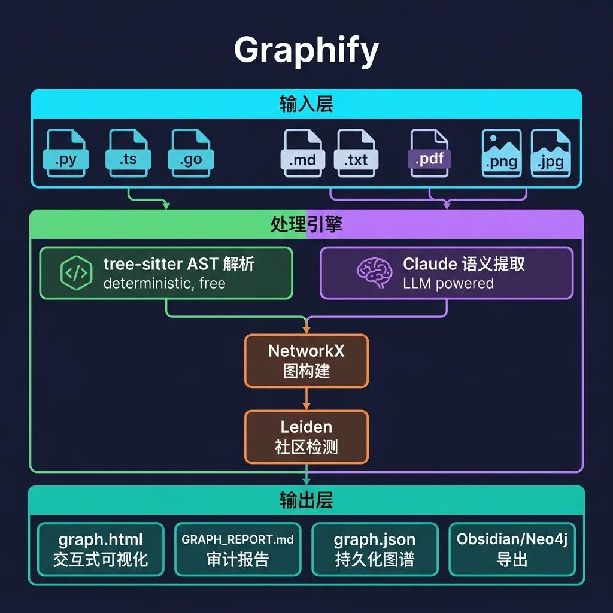
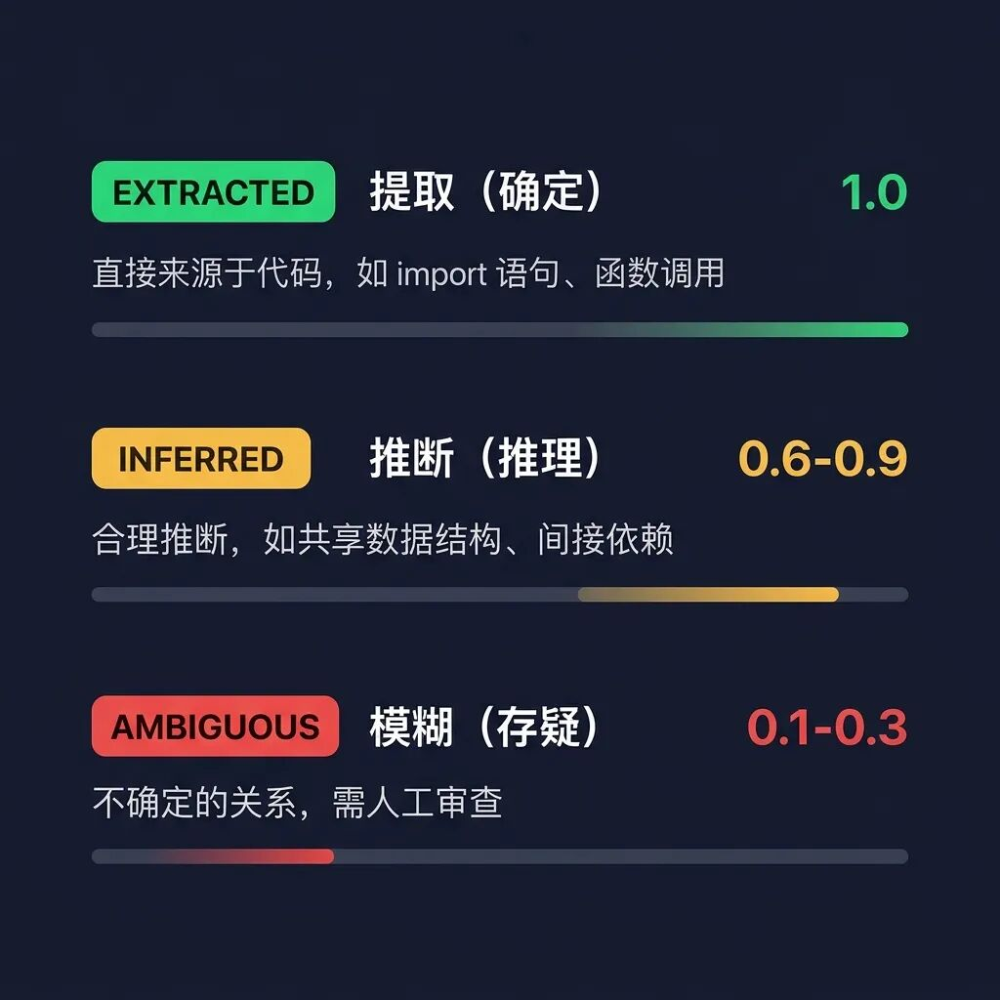

# Graphify：把 Karpathy 的 LLM Wiki 从理念变成了产品

**作者**: AI‰ΩúºäÁ†Å
**原文链接**: https://mp.weixin.qq.com/s/gkz3l8QiVmL3CsRUvtSygQ
**抓取时间**: 2026-04-12 17:56:12

---
 🔬 开源项目 Graphify 深度剖析 当 Karpathy 说「用 LLM 编译知识」时，一个开源项目把它做成了一条完整的流水线。 
 / graphify — 一个命令，把任何文件夹变成可查询的知识图谱。 ⭐ 3.2k Stars · 🍴 301 Forks · 📦 Python · MIT License 📌 这篇文章的前置阅读 本文是 Karpathy LLM 知识库 系列的第二篇。Karpathy 在 2026 年 4 月初提出了「用 LLM 编译个人知识库」的理念（详见 Karpathy 的 LLM Wiki——当 AI 成为你的知识管家 解读），而 Graphify （github.com/safishamsi/graphify）是 第一个将这一理念工程化实现 的开源项目，发布一周即获得 3200+ Star。 ## 一、Graphify 是什么？ 一句话定义： Graphify 是一个 AI 编程助手技能（Skill） ，你在 Claude Code、Codex、OpenCode 等工具里输入 /graphify ，它就会读取文件夹中的所有内容——代码、文档、论文、截图、白板照片——然后构建一张 可查询的知识图谱 。 💡 Graphify 比 Karpathy 的原始理念进化了什么？ Karpathy 的 llm-wiki 是一份 思想文档 （idea file），核心理念是「LLM 当图书管理员，维护 Markdown Wiki」。而 Graphify 在此基础上做了三个关键进化： 🔸 从 Wiki 到 Graph — 不是平面的 Markdown 文件，而是 NetworkX 知识图谱 + Leiden 社区检测 🔸 双轨提取引擎 — 代码文件走确定性 AST 解析（零 Token 消耗），文档/图片走 LLM 语义提取 🔸 信任审计链 — 每条边都标记为 EXTRACTED / INFERRED / AMBIGUOUS，你永远知道什么是「找到的」、什么是「猜的」 ## 二、七级流水线：深入架构 Graphify 的核心是一条 七级处理流水线 ，每一级都是一个独立的 Python 模块，通过纯 dict 和 NetworkX 图进行通讯——无共享状态，无副作用：  这条流水线的精妙之处在于 提取阶段的双轨并行设计 ： 🔧 左轨：tree-sitter AST 静态解析 对代码文件进行确定性的语法树分析：类、函数、import、调用图、docstring。 不需要 LLM，零 Token 消耗，毫秒级完成。 支持 16 种编程语言：Python、TypeScript、Go、Rust、Java、C/C++、Ruby、Swift 等。 🧠 右轨：Claude 语义提取（并行子代理） 对文档、论文、图片启动 并行子代理 （每 20-25 个文件一个批次），利用 Claude 的视觉能力提取概念、实体、引用关系和 设计决策的「为什么」 。所有子代理在同一消息中调度，真正的并行执行。 ## 三、全局架构：从输入到输出  整个系统的 技术栈极其精简 ： 图引擎： NetworkX（纯 Python，无外部依赖） 社区检测： Leiden 算法（graspologic 库）— 基于边密度，不需要 embedding 代码解析： tree-sitter（确定性 AST，16 种语言） 可视化： vis.js（交互式 HTML 图谱） LLM 后端： Claude（Claude Code）/ GPT-4（Codex）/ 你平台用的任何模型 ⚡ 关键设计决策：无向量数据库 Graphify 刻意不使用 embedding 和向量数据库 。聚类完全基于图拓扑结构——Leiden 算法通过边密度发现社区。Claude 提取的语义相似性边（ semantically_similar_to ）直接作为图的边参与社区检测。 
 图结构本身就是相似性信号 ——不需要单独的 embedding 步骤。 ## 四、信任审计链：知识图谱的「可追溯性」 这是 Graphify 最有价值的设计之一—— 每条边都附带一个置信度标签 ，让你清楚地知道每条关系是「确定发现的」还是「AI 猜测的」。  🟢 EXTRACTED（提取） ：关系直接来源于代码——import 语句、函数调用、论文引用。置信度永远是 1.0 🟡 INFERRED（推断） ：合理推论——共享数据结构、隐含依赖。每条边独立评分 0.4-0.9 🔴 AMBIGUOUS（存疑） ：不确定的关系，标记供人工审查。置信度 0.1-0.3 此外，Graphify 还提取了一种特殊的节点类型—— rationale_for（设计原理） 。代码中的 # WHY: 、 # HACK: 、 # NOTE: 注释和文档中阐述设计权衡的段落，会被提取为「原理节点」，指向它们解释的概念。 不只是记录代码做了什么，还记录为什么这样做。 ## 五、71.5× Token 压缩：数字背后的逻辑 71.5× 每次查询的 Token 减少倍率（混合语料库 52 个文件基准测试） 这是怎么做到的？ 第一次运行 ：消耗 Token 进行提取和图谱构建（一次性成本） 后续每次查询 ：读取紧凑的 graph.json 而非原始文件——这就是节省 71.5× 的来源 SHA256 缓存 ：重新运行只处理变更的文件，增量更新已有图谱 简单来说： 付一次「编译」成本，获得无限次高效查询。 查询次数越多，ROI 越高。对于 6 个文件的小项目，图谱的价值在于结构清晰度；对于 50+ 文件的大项目，压缩效果显著。 ## 六、亮眼特性逐个拆解 🔮 超边（Hyperedges） 传统图谱只有「A→B」的成对边。Graphify 支持 超边 ——3 个以上的节点参与同一个概念、流程或模式。例如：所有实现认证流程的函数、所有实现同一接口的类。每个 chunk 最多生成 3 条超边。 🌐 全模态支持 代码、PDF、Markdown、截图、架构图、白板照片、甚至其他语言的图片——Graphify 用 Claude 视觉能力理解图中的内容（不是简单 OCR），提取概念和关系，融入统一的图谱。 🔄 Always-On 模式 运行 graphify claude install 后，Claude Code 的 PreToolUse 钩子会在 每次 Grep/Glob 操作前 先读取图谱报告。AI 助手按图谱结构导航，而不是暴力搜索文件。 📡 MCP 服务器模式 --mcp 把图谱暴露为 MCP stdio 服务器，提供 query_graph、get_neighbors、shortest_path 等工具。接入 Claude Desktop 或任何 MCP 兼容的 Agent 编排器，让其他 AI Agent 实时查询你的知识图谱。 ## 七、5 分钟上手 # 安装 pip install graphifyy && graphify install # 在 Claude Code / Codex 中一键运行 /graphify . # 对特定文件夹运行 /graphify ./raw # 深度模式（更激进的推断边提取） /graphify ./raw --mode deep # 增量更新（只处理变更文件） /graphify ./raw --update # 查询知识图谱 /graphify query "attention 和 optimizer 之间有什么联系？" # 两个概念之间的最短路径 /graphify path "DigestAuth" "Response" 运行完成后， graphify-out/ 目录下会生成： 📊 graph.html — 交互式知识图谱，可搜索、过滤、按社区着色 📝 GRAPH_REPORT.md — God 节点、意外连接、建议查询问题 📦 graph.json — 持久化图谱数据，支持跨会话查询 💾 cache/ — SHA256 缓存，增量更新只处理变更文件 ## 八、对照：Karpathy 理念 vs Graphify 实现 📐 维度对比 存储格式 ｜Karpathy: Markdown Wiki → Graphify: NetworkX 图 + JSON 知识发现 ｜Karpathy: LLM 手动维护反向链接 → Graphify: Leiden 算法自动社区检测 代码处理 ｜Karpathy: 全部走 LLM → Graphify: 代码走 AST（零 Token），文档走 LLM 可信度 ｜Karpathy: 无标注 → Graphify: 三级置信度标签 + 分数 增量更新 ｜Karpathy: 概念性描述 → Graphify: SHA256 缓存 + --update + git hooks 多模态 ｜Karpathy: 提及图片 → Graphify: 完整视觉理解（截图/图表/白板） 工具生态 ｜Karpathy: Obsidian → Graphify: HTML + Obsidian + Neo4j + MCP + SVG 🎯 核心洞察 ：Karpathy 的理念本质上是「LLM 维护 Flat File Wiki」。Graphify 把它升级为「LLM + AST 共同构建 Knowledge Graph」——这不是简单的工程实现，而是 范式提升 ：从文档管理到图计算。 ## 九、隐私与安全 🔒 代码文件 通过 tree-sitter 在本地处理—— 不会离开你的机器 📄 文档/论文/图片会发送到你正在使用的 AI 平台的模型 API（Anthropic / OpenAI） 🚫 无遥测、无使用追踪、无任何分析 🛡️ URL 验证、路径沙箱、内容大小限制、HTML 转义——完整的安全防护层（见 security.py） 📮 编辑评语 Graphify 的出现充分证明了 Karpathy 提出的「LLM 编译知识」理念不只是推特上的灵感碎片——它是一个 可落地、可工程化、可扩展的架构模式 。 特别值得注意的是 Graphify 的 「诚实」设计哲学 ——不是给你一个黑盒答案，而是通过三级置信度标签让你看到知识的 可追溯性 。在 AI 幻觉仍是主要挑战的今天，这种透明度可能比功能本身更有价值。 如果你正在用 Claude Code 写代码或做研究， 花 5 分钟试试 /graphify 。你会发现它帮你看到了代码库中自己都不知道存在的连接。 — END — 🔗 项目地址：github.com/safishamsi/graphify 
 📄 Karpathy 原始 Gist：gist.github.com/karpathy/442a6bf